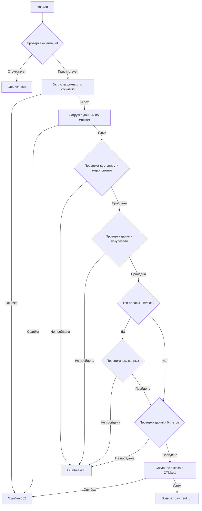

# Создание заказов через API

## Общие сведения
API-метод: `POST events/:id/order`  
Формат данных: JSON  
Ограничения: событие должно иметь `external_id`

## Алгоритм работы



## Шаги обработки запроса

### 1. Проверка входных данных
- Запрос должен быть в формате JSON (иначе ошибка 400)
- Событие должно иметь `external_id` (иначе ошибка 404)

### 2. Получение данных о событии и местах
- Получение информации о событии:
  ```
  GET /api/rest/v1/events/:id
  ```
- Получение информации о категориях мест:
  ```
  GET /api/rest/v1/shows/:id/seats
  Content-Type: application/json
  
  {
    "flat": true,
    "select": [
      "free_quantity",
      "disabled"
    ]
  }
  ```
- При ошибке внешних запросов возвращается 502

### 3. Проверка доступности мероприятия
Все условия должны быть выполнены:
- `event.data.is_active` равен "1"
- `event.data.shows[0].is_active` равен "1"
- Если `event.data.shows[0].sale_start_date` не null, текущая дата ≥ этой даты
- Текущая дата < `event.data.shows[0].sale_finish_date`

При невыполнении любого условия - ошибка 400

### 4. Проверка данных покупателя
Обязательные поля:
- `first_name` - строка
- `last_name` - строка
- `email` - валидный email
- `phone` - валидный телефон в международном формате (опционально)
- `payment_id` - один из ID из массива `event.data.payments`

Если `event.data.payments[payment_id].handler` равен "invoice", требуются дополнительные поля:
- `inn` - валидный ИНН
- `legal_name` - строка

### 5. Проверка данных билетов
Для каждого билета в массиве `tickets`:
- `type_id` должен существовать в объекте `seat.data`
- `seat.data[type_id].disabled` должен быть `false`
- Количество билетов с таким `type_id` < `seat.data[type_id].free_quantity`
- `first_name` - строка
- `last_name` - строка
- `email` - валидный email, уникальный в рамках всех билетов в запросе

### 6. Создание заказа в QTickets
Запрос:
```
POST /api/rest/v1/orders
```

Пример тела запроса:
```json
{
    "data": {
        "client": {
            "email": "marklangovoi@gmail.com",
            "details": {
                "name": "Марк",
                "surname": "Ланговой",
                "phone": "+79183628576"
            }
        },
        "fields": {
            "legal_name": "ИП Ланговой М.В",
            "inn": "234993591340"
        },
        "site": {
            "host": "krd.dev"
        },
        "payment_id": 76,
        "event_id": 116,
        "currency_id": "RUB",
        "baskets": [
            {
                "show_id": 144,
                "seat_id": "vhodnoj-1;1",
                "client_email": "marklangovoi+1@gmail.com",
                "client_name": "Марк1",
                "client_surname": "Ланговой1"
            },
            {
                "show_id": 144,
                "seat_id": "vhodnoj-1;1",
                "client_email": "marklangovoi+2@gmail.com",
                "client_name": "Марк2",
                "client_surname": "Ланговой2"
            }
        ]
    }
}
```

Особенности:
- `data.site.host` берётся из запроса
- `data.fields` включается только если `event.data.payments[payment_id].handler` равен "invoice"

### 7. Обработка результата
- При ошибке - код 502
- При успехе - возвращается `data.payment_url` из ответа QTickets

## Пример запроса
```json
{
  "first_name": "Марк",
  "last_name": "Ланговой",
  "email": "marklangovoi@gmail.com",
  "phone": "+79183628576",
  "payment_id": 1,
  "tickets": [
    {
      "type_id": "bilet",
      "first_name": "Марк",
      "last_name": "Ланговой",
      "email": "marklangovoi@gmail.com"
    }
  ]
}
```
